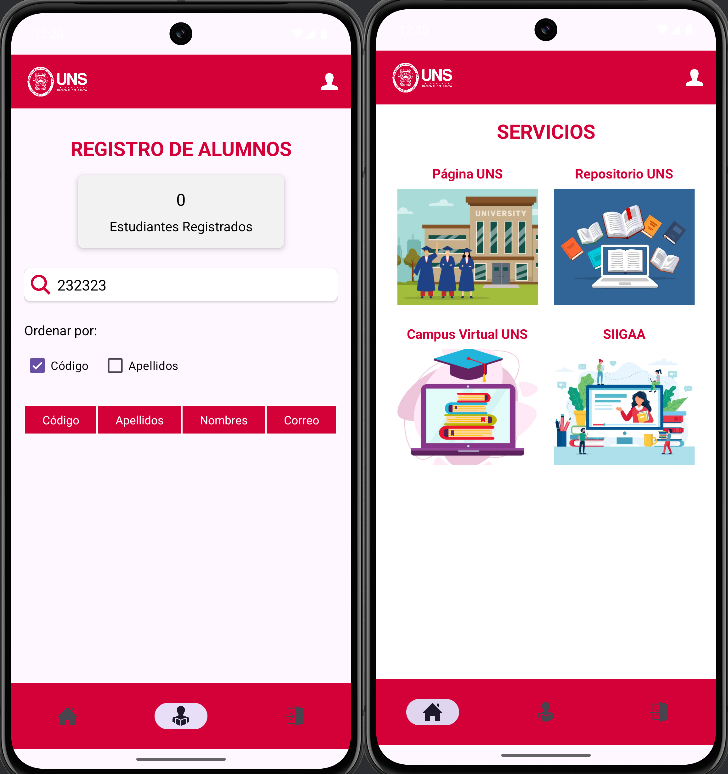
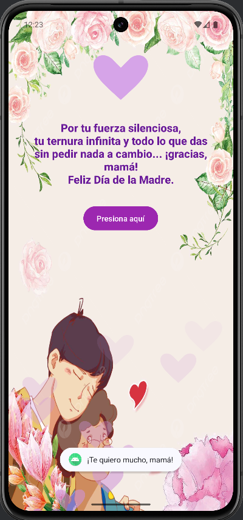
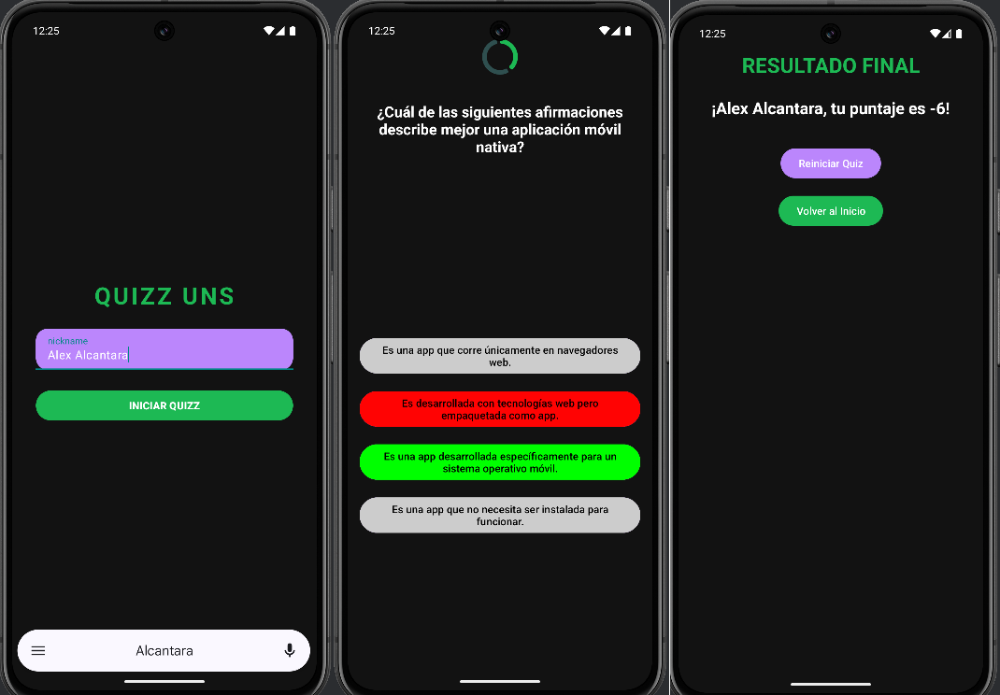
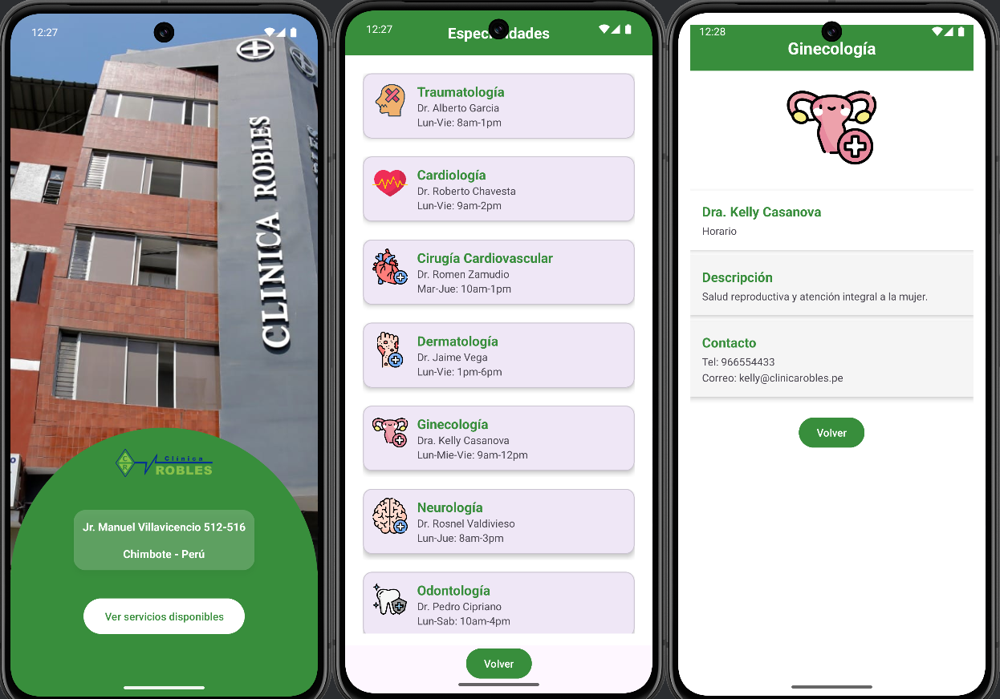
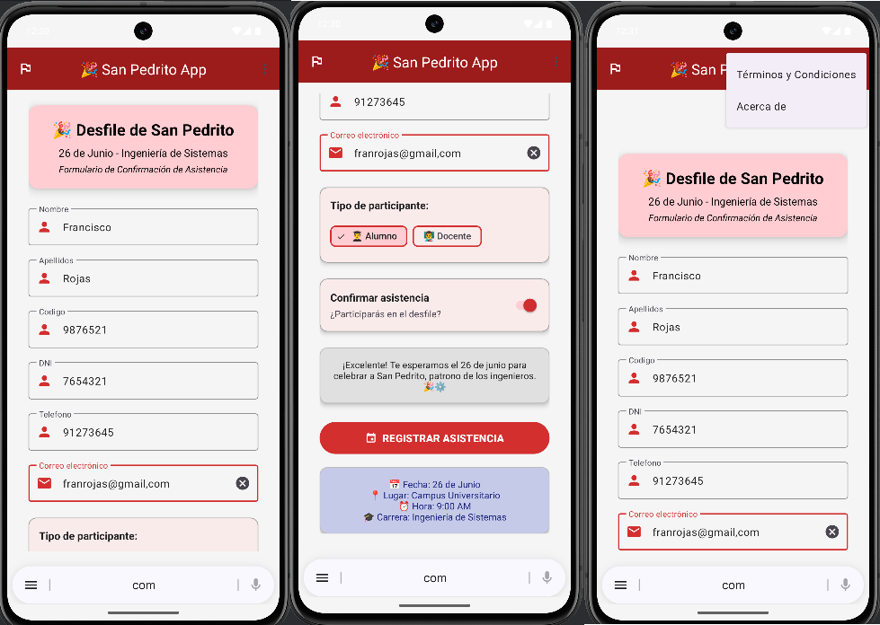
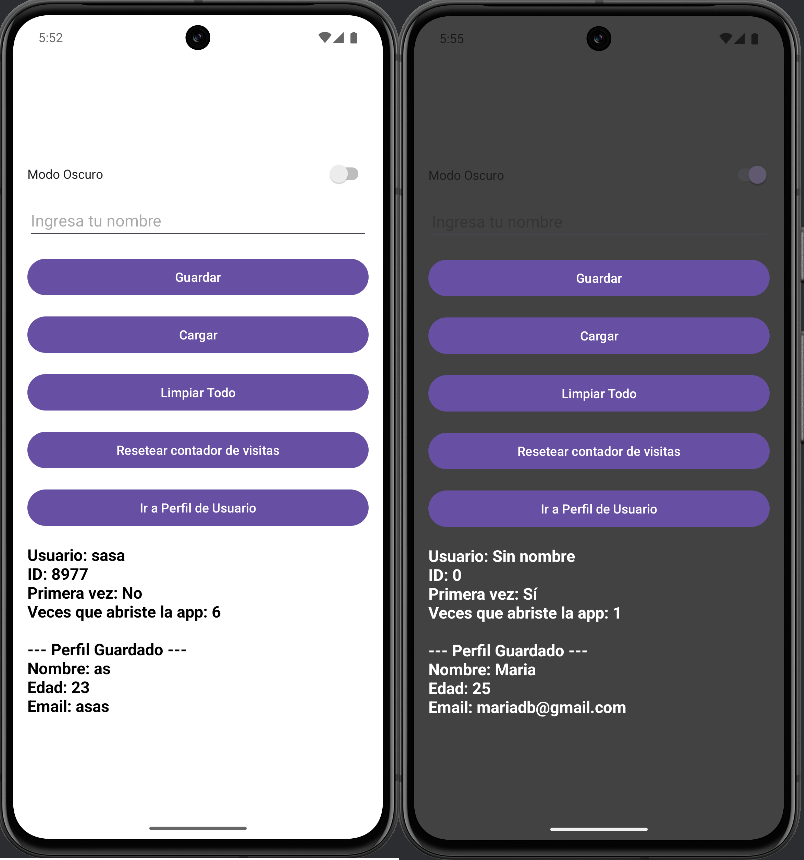
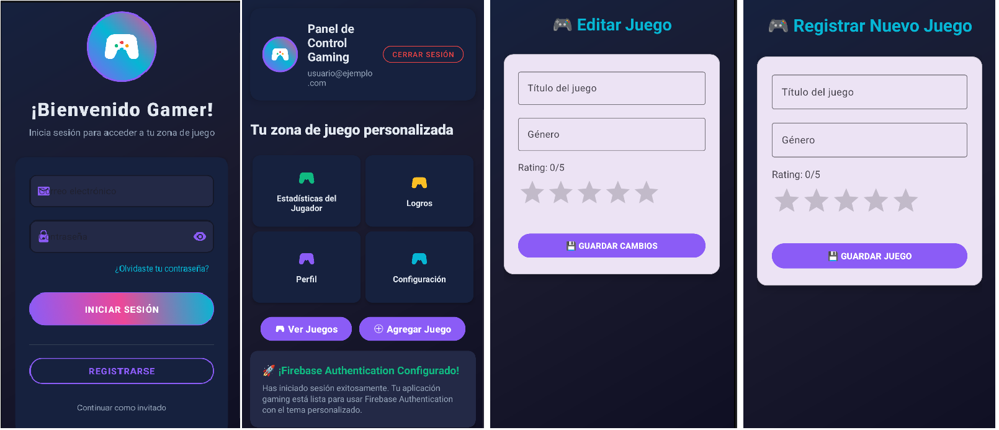
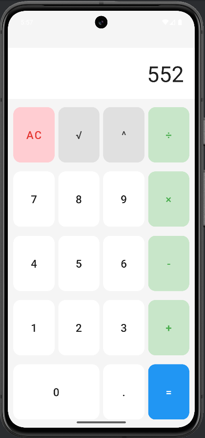

# Aplicaciones Móviles – Proyectos Android Studio 📱

Este repositorio contiene múltiples proyectos desarrollados en Android Studio como parte del curso de **Aplicaciones Móviles**. Los proyectos están organizados en carpetas, cada una representa una aplicación distinta implementada con Kotlin y/o Java.

## 📂 Estructura de Carpetas
- `S01_Login`: Login básico (solo diseño).
- `S02_RegistroAlumnos`: App para registrar alumnos y mostrarlo en una tabla con filtros.
- `S03_CartaDiaMadre`: Carta en honor al dia de la madre usando componentes visuales.
- `S04_Quizz`: App tipo quiz con 15 preguntas de opción múltiple y retroalimentación visual.
- `S05_ClinicaRobles`: App para una clínica médica con lista de especialidades usando RecyclerView.
- `S08_SanPedrito`: App de formulario para confirmar la asistencia de docentes y alumnos al desfile de San Pedrito.
- `S09_SharedPreferencesApp`: App para crear y guardar perfiles de usuario usando SharedPreferences.
- `S10_GameVaultApp`: App que guarda estadisticas, logros, permite ver y agregar videojuegos.
- `S12_Calculadora`: Calculadora básica con operaciones y manejo de estado usando ViewModel y LiveData.


## 📱 Sobre los proyectos

### 📁 S01_Login

#### 📄 Descripción
Este proyecto consiste en una pantalla de login básica con campos de usuario y contraseña, implementado únicamente con diseño visual (sin funcionalidad de autenticación).

#### 🎯 Finalidad
Practicar el diseño de interfaces móviles en Android Studio, aplicando principios de Material Design para formularios de inicio de sesión.

#### 🧰 Recursos usados
- **Lenguaje:** Kotlin  
- **IDE:** Android Studio  
- **Componentes usados:**
  - EditTex
  - Button
  - TextView
  - ConstraintLayout
  - Material Design

#### 🖼️ Capturas de pantalla

| Pantalla de Login |
|-------------------|
|  |


---

### 📁 S02_RegistroAlumnos

#### 📄 Descripción
Aplicación que permite registrar alumnos con sus datos básicos y mostrarlos en una tabla con opción de filtrado por nombre o código.

#### 🎯 Finalidad
Practicar la recolección de datos desde formularios y su visualización en una lista filtrable.

#### 🧰 Recursos usados 
- RecyclerView
- EditText + filtros en tiempo real 
- Material Design

#### 🖼️ Capturas de pantalla

| Registro y Lista de Alumnos |
|-----------------------------|
|  |

---

### 📁 S03_CartaDiaMadre

#### 📄 Descripción
Aplicación dedicada al Día de la Madre, que muestra una carta con diseño visual personalizado usando componentes gráficos.

#### 🎯 Finalidad
Desarrollar habilidades en diseño de interfaces con layouts y uso creativo de componentes visuales.

#### 🧰 Recursos usados
- LinearLayout / ConstraintLayout  
- ImageView, TextView 
- Estilos y personalización visual

#### 🖼️ Capturas de pantalla

| Carta Visual |
|--------------|
|  |

---

### 📁 S04_Quizz

#### 📄 Descripción
Aplicación tipo quiz con 15 preguntas de opción múltiple. Muestra retroalimentación visual para cada respuesta (correcta/incorrecta) y un resumen final.

#### 🎯 Finalidad
Practicar lógica condicional, manejo de eventos y navegación entre preguntas.

#### 🧰 Recursos usados  
- SharedPreferences (para guardar nombre y puntaje)  
- ProgressBar  
- Material Buttons  
- AlertDialog / Snackbar

#### 🖼️ Capturas de pantalla

| Pantalla de Preguntas | Resultados |
|------------------------|------------|
|  |

---

### 📁 S05_ClinicaRobles

#### 📄 Descripción
Aplicación de una clínica médica que muestra una lista de especialidades y sus médicos asociados. Interfaz moderna con diseño institucional.

#### 🎯 Finalidad
Aplicar el uso de RecyclerView, diseño dinámico de tarjetas, y personalización visual en apps reales.

#### 🧰 Recursos usados  
- RecyclerView  
- CardView  
- Material Design 3  
- Layout personalizado

#### 🖼️ Capturas de pantalla

| Lista de Especialidades |
|--------------------------|
|  |

---

### 📁 S08_SanPedrito

#### 📄 Descripción
Formulario móvil para confirmar la asistencia de docentes y alumnos al desfile de San Pedrito. Incluye validación de datos personales.

#### 🎯 Finalidad
Practicar el uso de formularios completos, validación y estructura visual institucional.

#### 🧰 Recursos usados
- EditText, Spinner, CheckBox  
- WebView (para términos y condiciones)  
- Material Design  
- Form validation

#### 🖼️ Capturas de pantalla

| Formulario San Pedrito |
|-------------------------|
|  |

---

### 📁 S09_SharedPreferencesApp

#### 📄 Descripción
App que permite crear y guardar un perfil de usuario (nombre, edad, correo) usando almacenamiento local con SharedPreferences.

#### 🎯 Finalidad
Aprender a guardar y recuperar datos simples de manera persistente en el dispositivo.

#### 🧰 Recursos usados
- SharedPreferences  
- Formulario con validación  
- Dark Mode con `Switch`  
- Material Components

#### 🖼️ Capturas de pantalla

| Perfil de Usuario |
|-------------------|
|  |

---

### 📁 S10_GameVaultApp

#### 📄 Descripción
App para registrar, listar, editar y eliminar videojuegos favoritos del usuario. Guarda estadísticas, logros y detalles de cada juego.

#### 🎯 Finalidad
Desarrollar una app CRUD completa con interfaz profesional e integración con Firebase.

#### 🧰 Recursos usados  
- Firebase Realtime Database    
- CRUD completo (Crear, Leer, Actualizar, Eliminar)  
- Filtros y búsquedas por género o título

#### 🖼️ Capturas de pantalla

| Lista de Juegos |
|------------------|
|  |

---

### 📁 S12_Calculadora

#### 📄 Descripción
Calculadora básica que permite realizar operaciones como suma, resta, multiplicación, división, potencia y raíz cuadrada. Utiliza el patrón MVVM para manejar el estado de la app de manera reactiva y persistente.

#### 🎯 Finalidad
Aplicar el uso de **ViewModel** para mantener los datos persistentes ante cambios de configuración (como rotación de pantalla), y **LiveData** para actualizar automáticamente la interfaz cuando cambian los resultados.

#### 🧰 Recursos usados  
- ViewModel  
- LiveData  
- EditText, TextView, Buttons  
- ConstraintLayout  
- Lógica de operaciones matemáticas básicas

#### 🖼️ Capturas de pantalla

| Calculadora Básica |
|---------------------|
|  |


---


## 🛠 Requisitos

- Android Studio Arctic Fox o superior
- SDK mínimo: API 21 (Android 5.0)
- Kotlin (última versión recomendada)
- Gradle configurado


## 🚀 Cómo ejecutar un proyecto

1. Clona el repositorio:

```bash
git clone https://github.com/tu_usuario/AplicacionesMoviles.git
