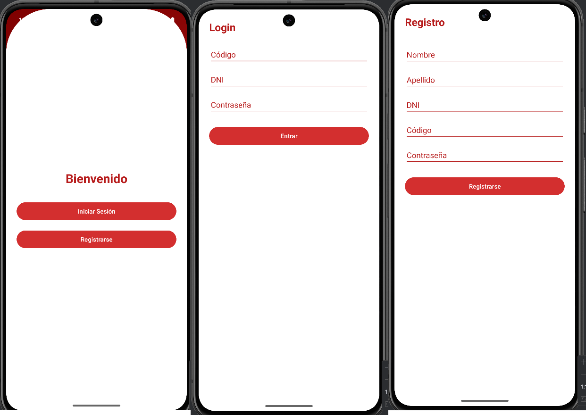

# Aplicaciones Móviles – Proyectos Android Studio 📱

Este repositorio contiene múltiples proyectos desarrollados en Android Studio como parte del curso de **Aplicaciones Móviles**. Los proyectos están organizados en carpetas, cada una representa una aplicación distinta implementada con Kotlin y/o Java.

## 📂 Estructura de Carpetas
- `S01_Login`: Login básico (solo diseño).
- `S02_RegistroAlumnos`: App para registrar alumnos y mostrarlo en una tabla con filtros.
- `S03_CartaDiaMadre`: Carta en honor al dia de la madre usando componentes visuales.
- `S04_Quizz`: App tipo quiz con 15 preguntas de opción múltiple y retroalimentación visual.
- `S05_ClinicaRobles`: App para una clínica médica con lista de especialidades usando RecyclerView.
- `S08_SanPedrito`: App de formulario para confirmar la asistencia de docentes y alumnos al desfile de San Pedrito.
- `S09_SharedPreferencesApp`: App para crear y guardar perfiles de usuario usando SharedPreferences.
- `S10_GameVaultApp`: App que guarda estadisticas, logros, permite ver y agregar videojuegos.


---

## 📱 Sobre los proyectos

### 📁 S01_Login

#### 📄 Descripción
Este proyecto consiste en una pantalla de login básica con campos de usuario y contraseña, implementado únicamente con diseño visual (sin funcionalidad de autenticación).

#### 🎯 Finalidad
Practicar el diseño de interfaces móviles en Android Studio, aplicando principios de Material Design para formularios de inicio de sesión.

#### 🧰 Tecnologías / Recursos usados
- **Lenguaje:** Kotlin  
- **IDE:** Android Studio  
- **Componentes usados:**
  - `EditText`
  - `Button`
  - `TextView`
  - `ConstraintLayout`
  - `Material Design`

#### 🖼️ Capturas de pantalla

| Pantalla de Login |
|-------------------|
|  |


---

## 🛠 Requisitos

- Android Studio Arctic Fox o superior
- SDK mínimo: API 21 (Android 5.0)
- Kotlin (última versión recomendada)
- Gradle configurado

---

## 🚀 Cómo ejecutar un proyecto

1. Clona el repositorio:

```bash
git clone https://github.com/tu_usuario/AplicacionesMoviles.git
